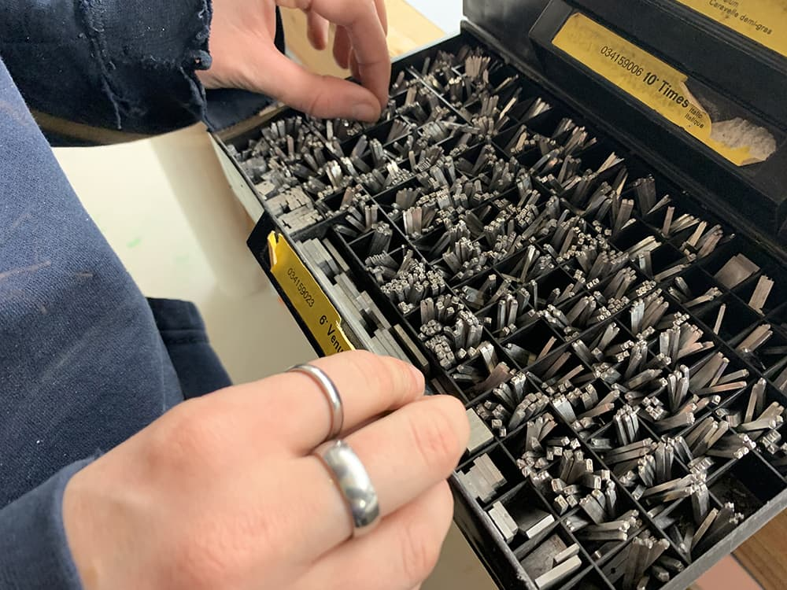

<link rel="stylesheet" href="css/style.css">

# Éditions La Petite Ourse

> Je m’en allais, les poings dans mes poches crevées ;  
Mon paletot soudain devenait idéal ;  
J’allais sous le ciel, Muse, et j’étais ton féal ;  
Oh ! là là ! que d’amours splendides j’ai rêvées !  
> -- Arthur  
  
## Mission 
### 👁️‍ Déconstruire les biais cognitifs en proposant de nouveaux angles de vision, des points de vue originaux et non conformistes. 
 

## Lancement de la collection la Damoiseau  

Voici les deux premiers titres d'une collection dont l'objectif est de mettre en lumière des textes majeurs dans l'évolution de la pensée féministe. L'insigne de cette collection est un sceau de femme-oiseau ou déesse-oiseau du néolithique.

1. _Le mystère oublié des généalogies féminines_,
**Luce Irigaray**.

1. _Comprendre le patriarcat_,
**bell hooks**.
  
   
     
Zines publiés le 8 mars 2025 à l'Atelier d'impression le Pieu. Offerts à 5$ en contribution volontaire (50% versé à une maison d'hébergement). Des versions numériques sont disponibles gratuitement, urls à venir. [Contactez-nous](mailto:editionsLaPetiteOurse@gmail.com) pour obtenir des exemplaires imprimés; nous faisons la livraison dans le périmètre des villes de Québec et Lévis. 

## À paraître
- *Ces parts d'ombre*, Richard Baillargeon (2025) 
 
## Projets numériques
### Jeux  
1. __La tactique des chèvres__ (prochain projet)  
Le développement de ce jeu est une commande de la [Guilde de la potière jalouse](https://fenouilcurcuma.github.io/guildedelapotierejalouse/).    
[Aperçu du jeu](la-tactique-des-chevres/pdf/bagh-chal_regles-du-jeu.pdf)    
2. __Mots de tête__    
[Consulter le code du jeu et/ou y collaborer](https://github.com/evefevrier/mots-de-tete)     
[Jouer à Mots de tête : version initiale](https://evefevrier.github.io/mots-de-tete/)       
[Jouer à Mots de tête : version de Christopher](https://christopherbyatt.github.io/mots-de-tete/)     

### Blogues
- [Le carnet d'UMi 🥷](billets/index.md)  
- [Instagram des Nuages blancs](https://www.instagram.com/les_nuages_blancs/) 
- [Tumblr de la petite Ourse](https://la-petite-ourse.tumblr.com/)
- [Tumblr de Mouchette](https://ziamercure.tumblr.com/)
- [Tumblr de R.B.](https://richardbaillargeon.tumblr.com/) 

### Robots-romans
avec les étudiant(e)s de première année de [TIM](https://timcsf.ca/)
- 🤖🤖🤖 [Robots-roman 2022](https://evefevrier.github.io/robots-roman/)
- 🤖🤖 [Robots-roman 2021](https://evefevrier.github.io/robots-roman/2021/)
- 🤖 [Robots-roman 2020](https://evefevrier.github.io/robots-roman/2020/)
  
  
## Partenaire
[Le Pieu, atelier d'impression](https://www.facebook.com/atelierlepieu)  
  

## Contact 
[Courriel](mailto:editionsLaPetiteOurse@gmail.com)  
[Site Web: Éditions la petite Ourse](https://evefevrier.github.io/editions-la-petite-ourse/)