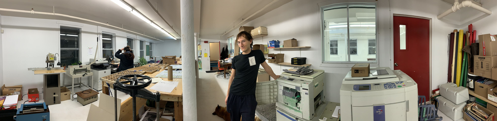

# Éditions La Petite Ourse

> Ursa Minor, abrégé UMi et appelée en français la Petite Ourse, est une petite constellation qui dégage peu de lumière comparée aux autres. 

  [Vikidia](https://fr.vikidia.org/wiki/Petite_Ourse)

_Welcome home_, à l'Auberge de la Petite Ourse.  
Un hâvre pour les petits poucets rêveurs et les pouceuses de la liberté de pensée.
  
## Mission
### 👁️ Encourager la relève artistique et littéraire.
### 👁️‍ Accueillir écrits et projets artistiques pour publication numérique ou sur papier. 
### 👁️‍ Combattre les biais cognitifs en proposant de nouveaux angles de vision, des points de vue originaux et non conformistes. 

## Projets numériques
### Robots-romans
avec les étudiant(e)s de première année de [TIM](https://timcsf.ca/)
- 🤖🤖🤖 [Robots-roman 2022](https://evefevrier.github.io/robots-roman/)
- 🤖🤖 [Robots-roman 2021](https://evefevrier.github.io/robots-roman/2021/)
- 🤖 [Robots-roman 2020](https://evefevrier.github.io/robots-roman/2020/)  

### Jeu "Mots de tête"
- [Jouer à "Mots de tête"](https://evefevrier.github.io/wordle/)
- [Consulter le code du jeu et/ou y collaborer](https://github.com/evefevrier/wordle)

### Tutoriels recommandés pour les auteurs et autrices
- [Git et Github pour les poètes](https://thecodingtrain.com/tracks/git-and-github-for-poets)

### Le carnet d'UMi 🥷

- [Intelligence artificielle et enseignement de la programmation](billets/ia-pedagogie-developpement-web.md)
- [En route vers la réalité](billets/letsgetreal.md)
- [IA et libre arbitre](billets/le-libre-arbitre.md)
- [Les veuves](billets/les-veuves.md)

[//]: # (- [The Broker / Le courtier]&#40;billets/trapped.md&#41;  )
  
[//]: # (  Bilan :)

[//]: # (  - [richardbaillargeon.ca]&#40;http://richardbaillargeon.ca&#41; OK)

[//]: # (  - [richard-baillargeon.com]&#40;http://richard-baillargeon.com&#41; OK)

[//]: # (  - <del>richardbaillargeon.com</del>  &#40;邪恶的中国海盗&#41;)
- [L'histoire des noirs avec Webster](billets/webster.md)

- [Le culte des ancêtres](billets/short-expedition-01.md)
- [Jardin de silice et jardin de sorcières](billets/first-roadtrip.md)

## Projets de livres imprimés
- *La Walking Woman de l'île d'Orléans* (en préparation)
- *Ces parts d'ombre*, Richard Baillargeon (à paraître en 2023) 
 
## Partenaires
[Collectif La Fatigue](https://www.facebook.com/editionslafatigue)  
[Le Pieu, atelier d'impression](https://www.facebook.com/atelierlepieu)  
  

[//]: # (![lePieu-police-venus]&#40;media/lePieu-police-venus.jpeg&#41;)

## Contact 
[Ève Février](mailto:editionsLaPetiteOurse@gmail.com)  
[Éditions la petite Ourse](https://evefevrier.github.io/editions-la-petite-ourse/)

 
