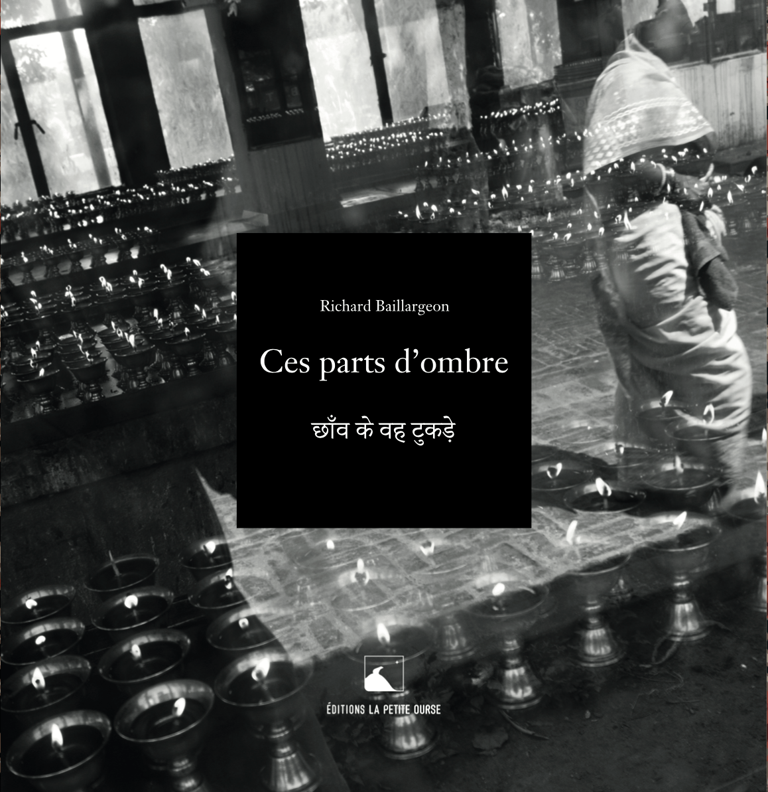
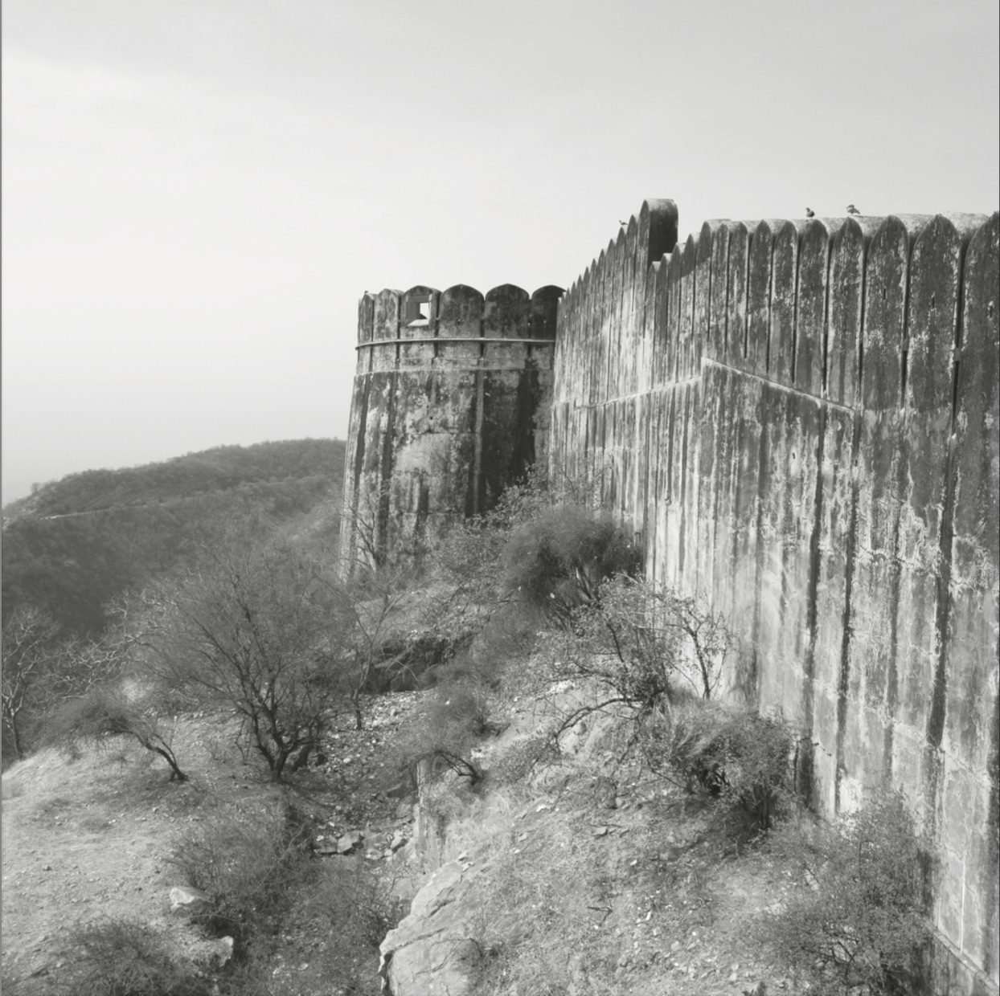
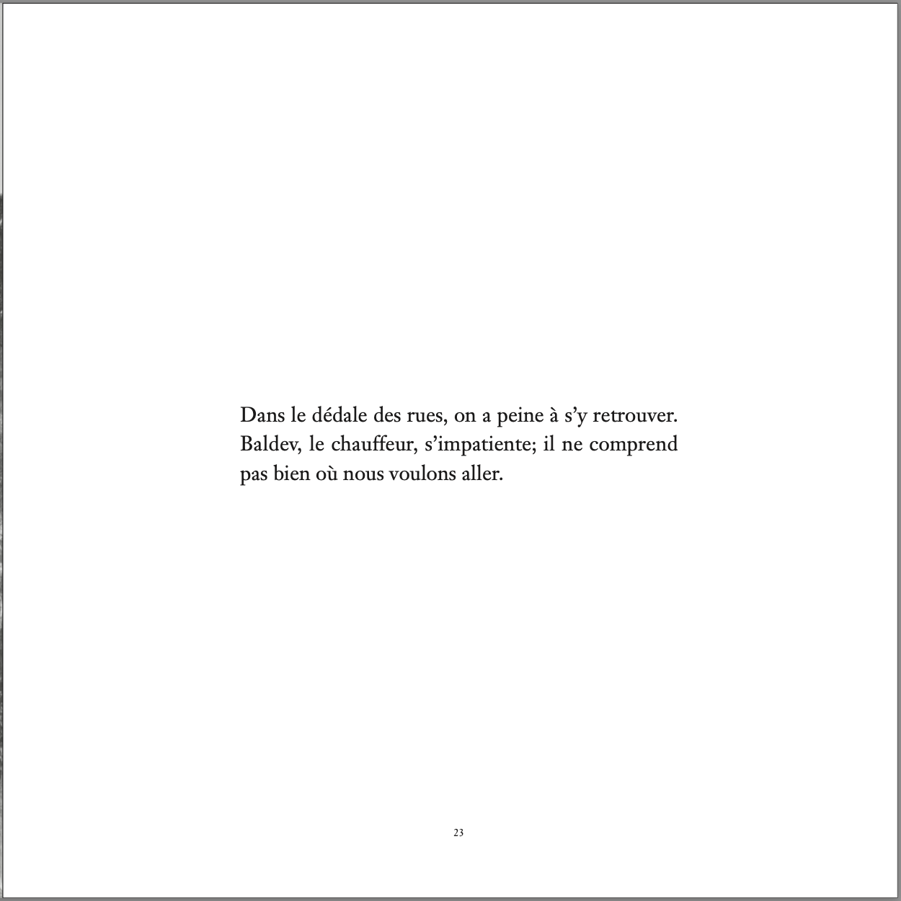
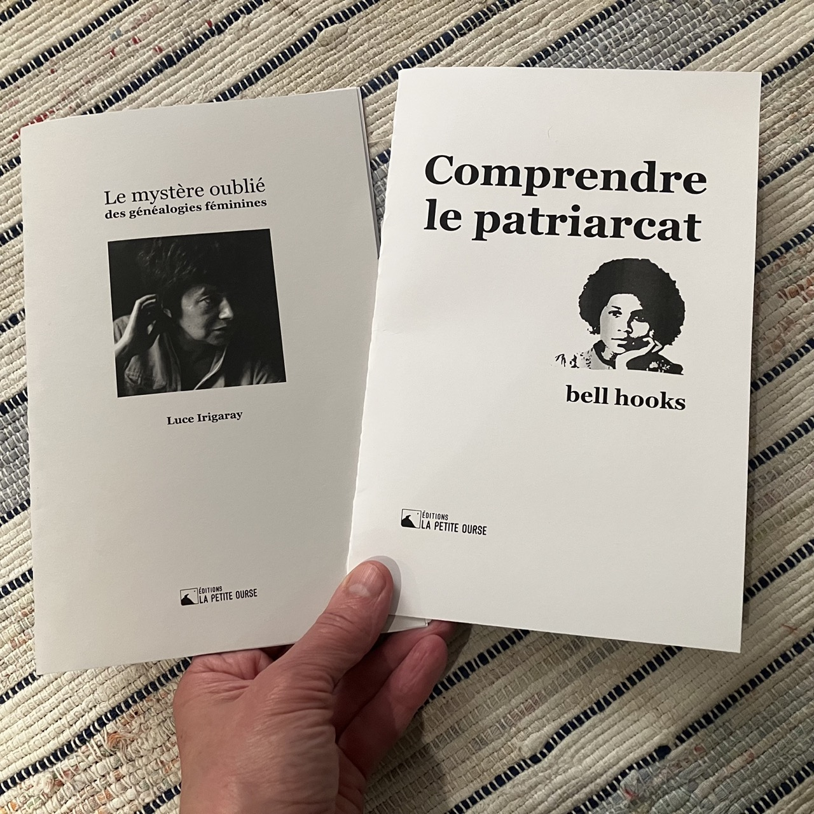
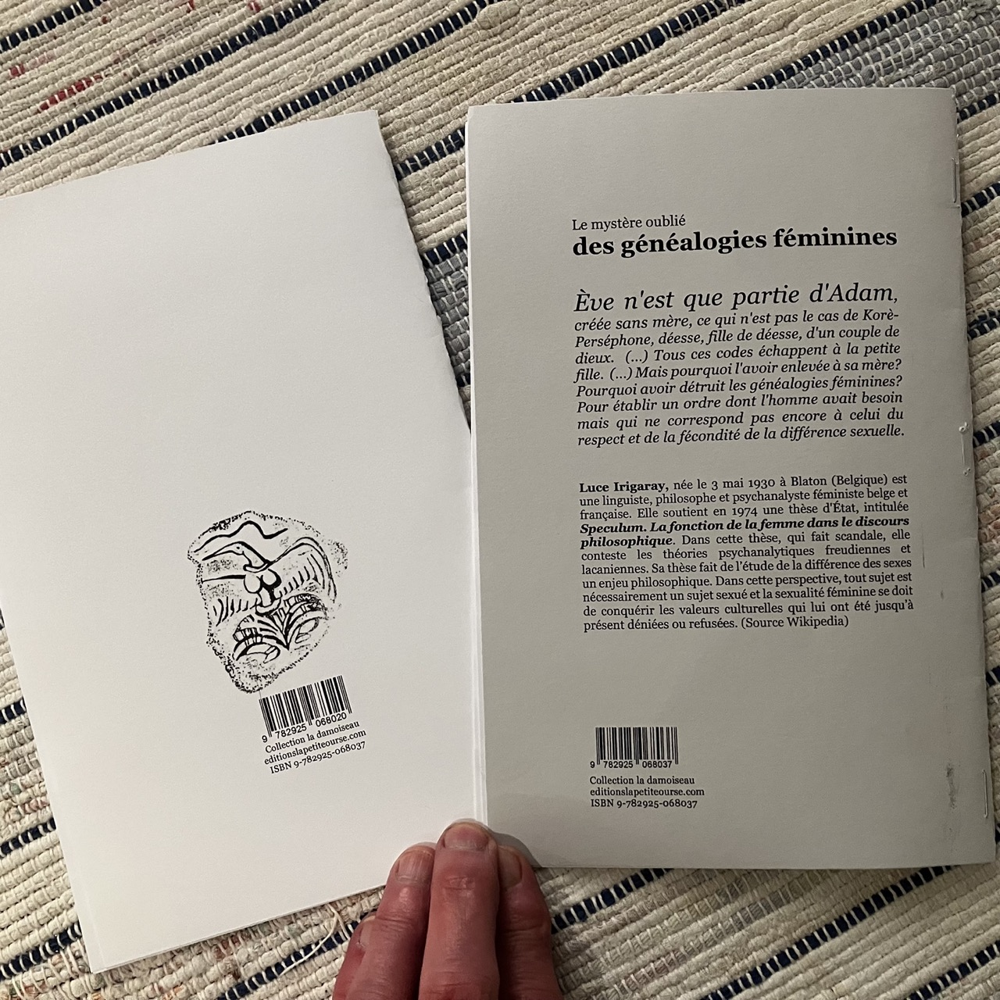
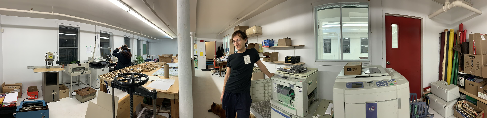
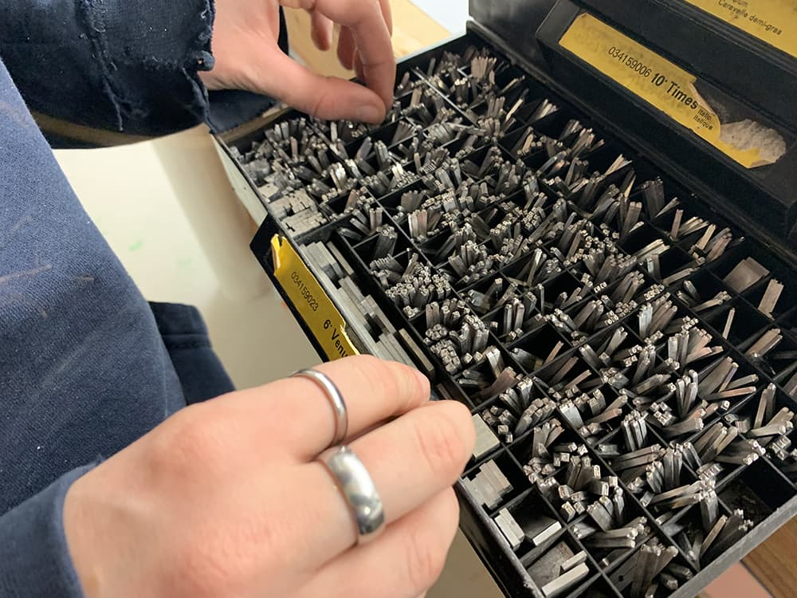

<link rel="stylesheet" href="css/style.css">

# Éditions La Petite Ourse

> Je m’en allais, les poings dans mes poches crevées ;  
Mon paletot soudain devenait idéal ;  
J’allais sous le ciel, Muse, et j’étais ton féal ;  
Oh ! là là ! que d’amours splendides j’ai rêvées !  
> -- Arthur  
  
## Mission 
### 👁️‍ Déconstruire les biais cognitifs en proposant de nouveaux angles de vision, des points de vue originaux et non conformistes. 
 

## Lancement *Ces parts d'ombre* de Richard Baillargeon 

 

__Mercredi 3 juin 2026, 17h à 19h. 
Librairie La Liberté. 
1073, route de l’Église, Québec (QC), G1V 3W2__

Dans cet ouvrage, Richard Baillargeon, anthropologue de formation et artiste reconnu, nous convie à une dérive sensible et contemplative à travers l’Inde. Chaque chapitre s'ouvre comme un souffle, porté par des textes poétiques présentés en français et en hindi, complétés par une version anglaise en fin d’ouvrage. La trame de ce carnet de route est finement tissée de 52 photographies noir et blanc et 18 illustrations couleur. 

« Des images et des mots pour dire la perte des repères, les états changeants de la rencontre des êtres et des choses. Des images et des mots pour dire des lieux inconnus, mais surtout pour dire l’expérience d’une altérité poi-gnante et, très souvent aussi, déstabilisante. Se trouver là, être là, dans cet ailleurs où nous sommes et demeurons fondamentalement des étrangers aux prises avec ce qui nous semble être un formidable chaos du sens, des sens. Marcher, s’arrêter, poser le regard, faire image : tels sont les pôles de l’expérience première. Par la suite, dans l’exercice de la mémoire, du souvenir, mettre des mots, choisir des images pour faire retour sur cette expérience.
Les images sont entrecoupées de courts récits liés à l’expérience de cet ailleurs indien au fil des déambulations au jour le jour. Des images et des mots qui sont finalement comme une série d’arrêts sur image, de cillements du regard. Images de nature et de ville, petites vignettes de l’espace et des aléas du regard alternent avec des images trouvées provenant d’une iconographie glanée dans cet univers fascinant mais combien déroutant qu’est le sous-continent indien [extrait du texte de présentation] ».

Ce livre s’impose comme une pièce de collection incontournable pour les passionnés de photographie contemporaine et de récits de voyage. 

Ces parts d’ombre sera disponible dès le 3 juin 2026 à la Librairie La Liberté et prochainement via le site leslibraires.ca.

  

## Collection la Damoiseau  

Voici les deux premiers titres d'une collection dont l'objectif est de mettre en lumière des textes majeurs dans l'évolution de la pensée féministe. L'insigne de cette collection est un sceau de femme-oiseau ou déesse-oiseau du néolithique.

1. _Le mystère oublié des généalogies féminines_,
**Luce Irigaray**.

1. _Comprendre le patriarcat_,
**bell hooks**.
  
   
     
Zines publiés le 8 mars 2025 à l'Atelier d'impression le Pieu. Offerts à 5$ en contribution volontaire (50% versé à une maison d'hébergement). Des versions numériques sont disponibles gratuitement, urls à venir. [Contactez-nous](mailto:editionsLaPetiteOurse@gmail.com) pour obtenir des exemplaires imprimés; nous faisons la livraison dans le périmètre des villes de Québec et Lévis.   
 
## Projets numériques
### Jeux  
1. __La tactique des chèvres__ (prochain projet)  
Le développement de ce jeu est une commande de la [Guilde de la potière jalouse](https://fenouilcurcuma.github.io/guildedelapotierejalouse/).    
[Aperçu du jeu](la-tactique-des-chevres/pdf/bagh-chal_regles-du-jeu.pdf)    
2. __Mots de tête__    
[Consulter le code du jeu et/ou y collaborer](https://github.com/evefevrier/mots-de-tete)     
[Jouer à Mots de tête : version initiale](https://evefevrier.github.io/mots-de-tete/)       
[Jouer à Mots de tête : version de Christopher](https://christopherbyatt.github.io/mots-de-tete/)     

### Blogues
- [Le carnet d'UMi 🥷](billets/index.md)  
- [Instagram des Nuages blancs](https://www.instagram.com/les_nuages_blancs/) 
- [Tumblr de la petite Ourse](https://la-petite-ourse.tumblr.com/)
- [Tumblr de Mouchette](https://ziamercure.tumblr.com/)
- [Tumblr de R.B.](https://richardbaillargeon.tumblr.com/) 

### Robots-romans
avec les étudiant(e)s de première année de [TIM](https://timcsf.ca/)
- 🤖🤖🤖 [Robots-roman 2022](https://evefevrier.github.io/robots-roman/)
- 🤖🤖 [Robots-roman 2021](https://evefevrier.github.io/robots-roman/2021/)
- 🤖 [Robots-roman 2020](https://evefevrier.github.io/robots-roman/2020/)
  
  
## Partenaire
[Le Pieu, atelier d'impression](https://www.facebook.com/atelierlepieu)  
  

## Contact 
[Courriel](mailto:editionsLaPetiteOurse@gmail.com)  
[Site Web: Éditions la petite Ourse](https://evefevrier.github.io/editions-la-petite-ourse/)