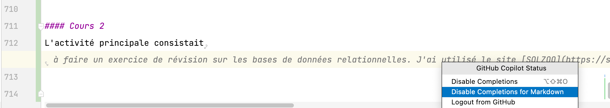

# Intelligence artificielle et enseignement de la programmation

À l'automne 2020, dans le cadre d'un cours d'introduction à la programmation, j'ai commencé à faire avec mes étudiants un projet nommé *Robots-roman*. Dans ce cours, mon but premier est de leur faire découvrir la programmation de manière visuelle et ludique, nous utilisons pour cela la [bibliothèque P5JS](https://p5js.org/). Cette bibliothèque JavaScript permets de dessiner dans le canevas de HTML5. Rapidement les personnes étudiantes peuvent explorer les fonctions de dessin pour créer un robot. Ensuite, on ajoute de l'animation, de l'interactivité et puis un décor et finalement ils doivent rédiger une description de leur robot répondant à la question:

> À qui, à quoi servirait ton robot s'il était réel et doté d'intelligence artificielle?

Voici la mise en situation initiale:

> 2061  
J’ai 97 ans.  
Je suis encore lucide et mobile mais très ratatinée et frêle.  
On se rencontre par hasard à quelque part d’improbable.  
Le soleil offre sa belle lumière automnale, la vie foisonne partout, l’air est bon,
on entend les mésanges chanter, un chien japper,
des rires d’enfants…
Oui, la planète va mieux!
Que s’est-il passé?
Comment avons-nous réussi à renverser la vapeur?
Quelles solutions créatives avons-nous mis en place
en s’appuyant sur l’intelligence artificielle?

Afin de sensibiliser les personnes étudiantes à l'IA, je leur propose l'écoute des premiers épisodes du [balado français "Algo Pop"](https://www.majelan.com/programs/d8f92b19-eb66-4d6a-8cdc-2fccf494b90a) qui mets en relation des classiques du cinéma de science-fiction avec des concepts de l'intelligence artificielle. De *2001, Odyssée de l'espace* à des épisodes de *Black Mirror*, en passant par *Rapport minoritaire* et bien sûr *Terminator*, les concepts d'intelligence artificielle spécifique à générale sont abordés ainsi que la [singularité](https://fr.wikipedia.org/wiki/Singularit%C3%A9_technologique), le [transhumanisme](https://fr.wikipedia.org/wiki/Transhumanisme), [l'effet Éliza](https://fr.wikipedia.org/wiki/Effet_ELIZA), la [théorie du *nudge*](https://fr.wikipedia.org/wiki/Th%C3%A9orie_du_nudge), les [biais algorithmiques](https://fr.wikipedia.org/wiki/Biais_algorithmique) et les [biais cognitifs](https://fr.wikipedia.org/wiki/Biais_cognitif).  

Éditions du projet robotsroman 
- [Portail des projets 2020](https://evefevrier.github.io/robotsroman/2020) 
- [Portail des projets 2021](https://evefevrier.github.io/robotsroman/2021) 
- [Portail des projets 2022](https://evefevrier.github.io/robotsroman/)  

À chaque édition, le thème des robots nous a permis de discuter de ce qu'est l'intelligence artificielle, de ce qu'elle peut faire mais surtout de développer un esprit critique face à l'IA.

À l'automne 2022, nous avons donc suivi de très près les progrès de l'IA dans le domaine de la création de contenu. La première IA qui a fait irruption dans le cours d'_introduction à la programmation_ est *Github CoPilot*. Cet assistant de programmation peut générer à partir d'un commentaire une fonction complète, un algorithme. Évidemment, c'est un accélérateur, une aide précieuse pour une programmeuse chevronnée qui sait discerner la meilleure solution et identifier les faiblesses du code proposé, mais pour un néophyte qui essaie de résoudre des problèmes sans comprendre la solution proposée, cette aide est un non-sens par rapport à l'acquisition de compétences.

Pour ceux et celles qui comme moi ont l'habitude de rédiger des textes au format *MarkDown* dans un éditeur de code, *Github CoPilot* est bavard. Une vrai pie. Il n'attend pas qu'on formule une requête comme *ChatGPT*, il suggère constamment des fins de phrase, du texte qui est parfois utile mais le plus souvent nuisible car au lieu d'être en train de préciser notre pensée en écrivant, on se fait déconcentrer par les suggestions de l'IA.  
  

<small>Après avoir écrit "L'activité principale était:", CoPilot me suggère quelle était l'activité principale!! Comme s'il pouvait savoir... Bien sûr mon activité principale n'avait rien à voir avec un exercice de révision sur les bases de données relationnelles. </small>

Plusieurs personnes étudiantes ont installé l'extension Github CoPilot dans leur éditeur de code. Plusieurs l'ont rapidement désactivé après s'être aperçu qu'ils trouvaient ça plus mêlant que aidant recevoir des suggestions qui peuvent n'avoir aucun rapport avec leur intention de programmation et leur niveau de connaissance.

Bientôt Dall-e et MidJourney se sont manifestés et ont été adoptés rapidement par les *gamers* qui respirent depuis longtemps dans *Discord*. En classe, la nouvelle d'[une IA qui aurait remporté un concours de peinture](https://ici.radio-canada.ca/nouvelle/1910055/jason-allen-concours-arts-ia-midjourney) a suscité des discussions sur les enjeux éthiques et les droits d'auteur.

*ChatGPT* est arrivé à la fin de la session juste à temps pour que quelques allumés l'utilisent pour compléter certains travaux.   
Au début de la session d'hiver j'ai retrouvé mes étudiants de l'automne dans le cours d'*Intégration II*.   
D'entrée de jeu, nous avons fait le point sur les outils d'intelligence artificielle à notre disposition dans le domaine de la programmation et du développement Web.
*ChatGPT* a pris beaucoup de place dans cette activité brise-glace. Qui l'a essayé? Ouais... qu'est-ce que tu lui as demandé? Comment t'as formulé ton _prompt_ ? Haha on peut lui faire dire des niaiseries!? Il peut se tromper... donc il faut vérifier ce qu'il avance... Est-il biaisé? Si oui, quels sont ses biais?...

En conclusion, les réflexions et discussions menées en classe autour du thème de l'intelligence artificielle, nous(1) amène à considérer les IA comme des outils qu'il faut apprendre à utiliser. Cela implique des efforts pour comprendre leur fonctionnement et leurs limites. Apprendre à les utiliser est un incontournable qui inclue le savoir-faire-taire nos assistants... la pédagogie collégiale doit rester centrée sur la formation d'êtres humains capables de réfléchir par eux-mêmes et de mettre des mots sur leur réflexion. 

Le cégep offre et doit continuer à offrir un milieu de vie respectueux de la neurodiversité et inclusif. Un milieu sécuritaire où des êtres humains peuvent s'épanouir en affirmant leur individualité, leur libre arbitre, leur créativité. De vrais pilotes, capables de prendre les rênes des *CoPilotes*.

Devant les complexités de la situation actuelle à l'échelle planétaire, il me semble qu'on doit viser à __former des personnes capables de coopérer pour trouver des solutions__, des personnes capables de participer à une __intelligence collective__ à laquelle les IA présentes et futures devront être __soumises__. 

---
(1)   
<small>J'élargis le *je* au *nous* en faisant référence aux communautés d'apprentissage et de pratique formées (ou en formation) par les cohortes successives de personnes étudiantes et diplômées du programme Techniques d'intégration multimédia du Cégep de Sainte-Foy, en particulier depuis la pandémie.</small>

