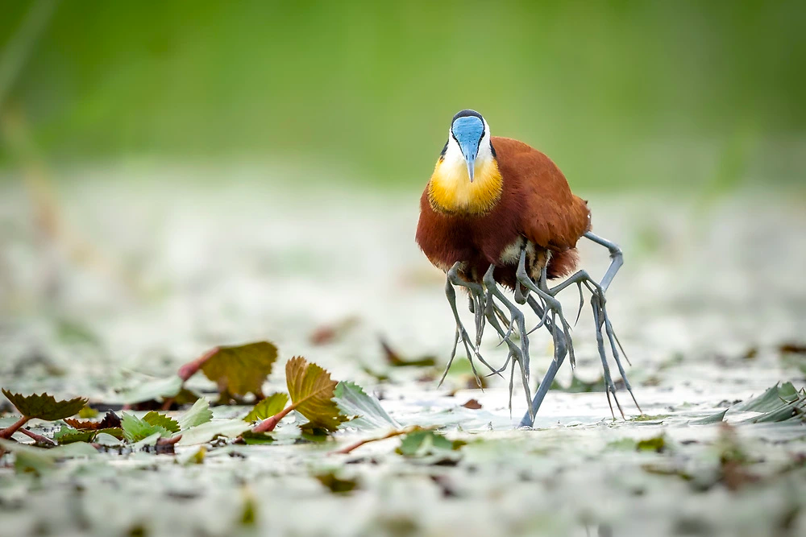
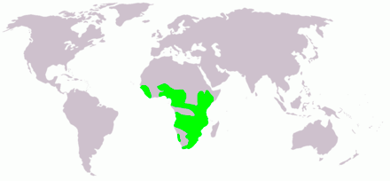

# La volière (ou bestiaire d'UMi)

[//]: # (## Incube / Succube)

[//]: # (> Lacan désigne sous le nom d'« incube idéal » le véritable objet d'adoration de la femme; ce partenaire idéalisé qui autorise la femme à une )

[//]: # ()
[//]: # (__« réceptivité d’étreinte [qui] a à se reporter en sensibilité de gaine sur le pénis »__ &#40;Lacan, 1973, p. 85&#41;.)

[//]: # ()
[//]: # (>, c'est-à-dire que la simple sensation organique provoquée par la pensée du viol permet un investissement libidinal, autoérotique, voire orgasmique. Par ce partenaire incube, la femme réinvestit son ego et renie le désir du phallus.)

## Le Jacana

<small>© Charl Stols "Male African Jacana carrying chicks."</small>

### Description
>Oiseau d’une trentaine de cm de long au maximum pour une masse d'environ 135 g chez le mâle et 265 g chez la femelle. 

__En effet, la femelle est plus grande que le mâle.__ 

> Le bec ainsi que la plaque portée par le front sont d’un gris bleu pâle. Les zones nues de la tête sont de la même couleur. Les pattes sont de couleur bleu ardoise. L’iris est brun foncé. Le dessus et l’arrière de la tête sont noirs, couleur qui se poursuit jusqu’au haut du dos et un peu sur le haut de la poitrine. Ce même noir traverse les yeux et atteint presque le bec. Le cou et les joues sont blancs. La poitrine est jaune dorée à brune. Le reste de la teinte est brun assez homogène.  
> Quatre œufs brillants, couleur ocre brun pâle, décoré de cercles plus foncés, sont pondus (+/- 3 x 2,3 cm).   
> C’est une espèce grégaire qui reste souvent au même endroit, sauf lorsque la nourriture vient à manquer. D’ailleurs, cet oiseau se nourrit surtout de petits poissons et d’invertébrés aquatiques. Le cri peut-être un *krreeeekk* vibrant ou encore un *kouuh* répété assez rapidement.  

<small>Source: https://fr.wikipedia.org/wiki/Jacana_à_poitrine_dorée</small>

### Précisions étymologiques et comportementales
__Actophilornis Africanus__  
Actophilornis est un mot latin formé à partir des mots __"actus" (mouvement)__ et __"philornis" (aimant les oiseaux)__.  

> La période de reproduction a lieu toute l'année en fonction des régions mais toujours en fonction de la saison des pluies.  

__Cette espèce a développé un système de reproduction polyandrique.__ 

> C'est donc la femelle qui s'accouplera avec plusieurs mâles et les mâles qui élèveront les poussins. Durant cette période, les oiseaux se regroupent par couple ou en petit groupe.
> C'est au mâle que revient toute la tâche de la nidification. Avant d'attirer une femelle, il construit un nid sommaire sur la végétation constitué d'algues pourries ou directement sur une grande feuille de nénuphar. Le mâle se sert aussi des feuilles de grandes fougères exotiques pour y construire son nid afin d'éviter sa destruction par le passage des ragondins. Une fois le nid terminé, il appelle la femelle en caquetant et en jetant des matériaux ayant servi à sa construction. 

__La parade nuptiale commence dès lors que la femelle a choisi un mâle.__

> Sommaire et rapide, il s'agit pour les deux oiseaux de former des cercles en marchant tête vers le bas pour exposer au mieux leur plaque frontale bleu clair. 
> Avant l'accouplement, la femelle adopte une position accroupie bien connue, le mâle lui monte alors sur le dos après quelques coups de bec sur le corps. La femelle pond 4 œufs brun clair aux taches noires que le mâle incube à partir du troisième durant 21 à 26 jours. Dans la journée, le mâle couve par tranches de trente minutes entre lesquelles il part se nourrir. Aux heures les plus chaudes, il reste debout au-dessus des œufs pour les maintenir à l'ombre.

__La femelle, elle, part s'accoupler avec d'autres mâles, jusqu'à quatre durant la saison de reproduction.__ 

> À l'éclosion, le mâle éloigne les coquilles du nid et durant 40 à 70 jours, élève et protège ses poussins qui se nourrissent seuls, en les cachant dans les poches que forment ses ailes repliées pour les déplacer en cas de danger. Ces derniers, nidifuges, peuvent aussi plonger pour se cacher sous la végétation.

<small> Source: https://www.oiseaux.net/oiseaux/jacana.a.poitrine.doree.html</small>

### Répartition et habitat
  
Carte de répartition de l'espèce (en vert)  
