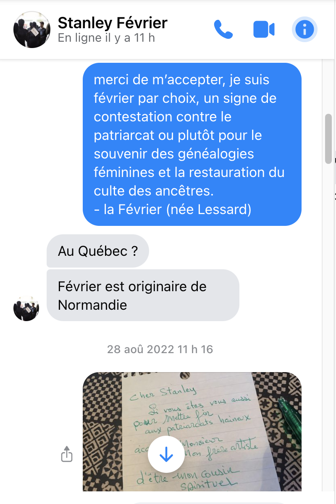
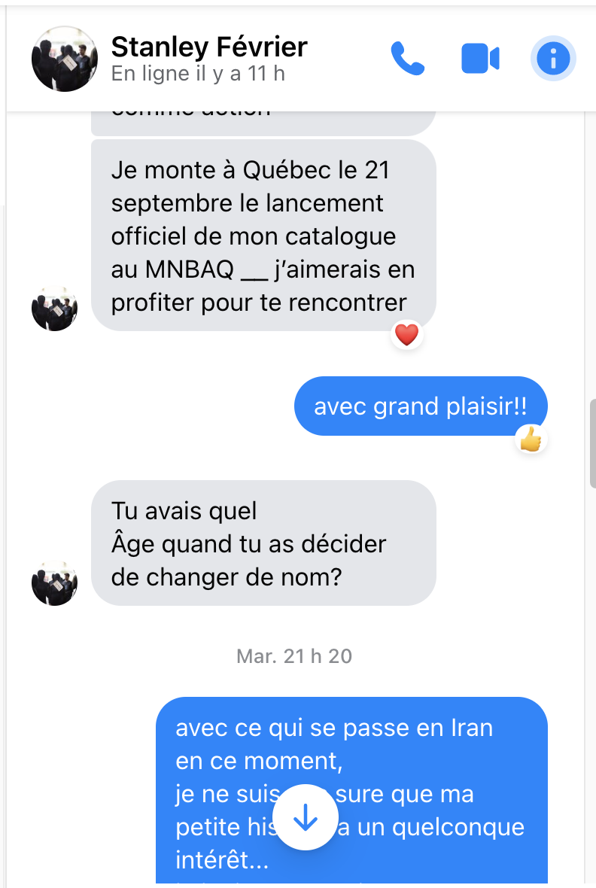

<link rel="stylesheet" href="../css/style.css">

# Ma rencontre avec Stanley 

> [Activer la pensée critique    
S’attaquer aux causes profondes de l’exclusion systémique   
et au déséquilibre des pouvoirs dans les arts.](https://www.fevrierstanley.com/)

  
 

Dans la vingtaine, mon amie Barbara Michaud m'a fait connaître [Luce Irigaray](https://fr.wikipedia.org/wiki/Luce_Irigaray).  
J'ai flashé sur son essai *«Le mystère oublié des généalogies féminines»*. 
  
  
  
C'est cette lecture qui m'a amené à décider de remplacer mon patronyme par un matronyme.  
Mais où aller chercher son matronyme ? Il faut remonter aux origines, à l'autre en soi, à la mémoire cellulaire ou au cerveau reptilien, je ne sais pas.    
  
__Février, c'est le mois de ma naissance.__    
  
> demain, je termine au cégep vers 18h  
j'arriverai donc vers la fin de la séance de signatures  
  
  

  
  

  

# UMi
*vendredi 23 septembre 2022*

UMi est le prénom de l'avatar.  
Un nom puissant donne du pouvoir.
Changer de nom, comme [Norval](https://www.invaluable.com/artist/morisseau-norval-d313z56a5l/sold-at-auction-prices/) devenu le _Copper Thunderbird_. <a href="#noteWikipedia">(*)</a>    
<del>
Un tournant dans la vie, un virage vers l'ailleurs.  
La cérémonie de ce changement sera liée subtileent et sans froufrou et flafla, 
à l'émergence de la <strong style="color:orange">Guilde de la potière jalouse</strong>.</del>

~~Un nom puissant donne du pouvoir et une grande vulnérabilité.    
Demain, c'est le passé et le passé est demain.~~

_Parler de soi à la 3e personne._    
Le corps est un véhicule de communication. 
Elle pèse plus ou moins 115 lbs, de taille moyenne, tout juste 1m63.  
Reste à peaufiner le look.   
Plus jeune, plus musclée, ce serait préférable.   
Références:     
1. la fille aux cheveux bleus de Bilal   
  
2. mais en plusse badass comme Lisbeth Salander   
([Noomi Rapace](https://fr.wikipedia.org/wiki/Noomi_Rapace) dans le rôle).  

  

# UMi se dévirtualisera
*Mercredi 11 janvier 11h11*
  
Chaque rencontre avec Stanley (3ème ce week-end) est une pétarade d'émotions et de petites portes qui s'ouvrent sur moi-même. Beaucoup de ces petites portes m'apportent de la joie. Le chakra du coeur est grand ouvert et c'est *boooonnnnnn*.   
  
<del><i>Je me sens en sécurité, en confiance, en paix.</i></del> -- ta gueule Github CoPilot  
  
(Je ne crois pas que *boooonnnnnn* soit dans le modèle de langage de l'IA. Mais ça viendra. Bientôt, elle aura en pâture mes écrits sur Github et plus tard vous pourrez demander un texte style "Ève Février". Mais vous aurez plutôt l'idée de demander un texte du style de l'excellent "David Goudreault" ou encore tiens, pourquoi pas style "Gaston Miron". Moi, je demanderai du style de "Margaret Atwood". Sa dystopie de "La servante écarlate" est un bijou de lucidité. Je l'admire sincèrement.)

Je vais écrire plus souvent içi.
L'objectif est de libérer UMi.
Hier, cette pensée m'a traversé l'esprit:  
> UMi s'installe à St-Antoine-du-Paradis pour y passer l'hiver.

<del><i>
<q>Elle y fait des rencontres et y apprend à se dévirtualiser.</q>
</i></del> -- ta gueule Github CoPilot

Donc, comme je disais, cette pensée m'a été inspirée par une affirmation de ChatGPT qui m'a interpellé:
> Parfois, le changement de nom peut être un moyen pour une artiste de s'éloigner de sa vie personnelle et de se concentrer sur son travail artistique.

Il va falloir que j'explique ce qu'est *__la Guilde de la Potière Jalouse__*.
Voilà mon principal projet, débuté à l'automne 2019, automne où, en congé avec salaire (traitement différé) je me suis lancé à corps perdu dans la poterie ou plutôt dans la céramique.

Cet automne-là, j'ai aussi pris le cours "ART314 - Atelier du livre d'artiste"(**) à l'Université de Sherbrooke. En fait, je m'étais inscrite au "Microprogramme de 2e cycle en édition" mais je n'ai pris aucun cours dans ce programme, l'offre cet l'automne là ne me convenant pas. Le syllabus du cours ART314 m'a vraiment séduite et j'ai adoré ça. La prof nous a fait expérimenter diverses techniques d'impression, de transfert d'image et de reliure. Elle nous a amené consulter une sélection de la collection de livres d'artistes du BANQ... C'était juste *wow*.  

Voilà comment est né le *__Codex de la Guilde de la Potière Jalouse__*...  
Un petit livre d'artiste comportant 4 pages en céramique et des couvertures cartonnées recouvertes de cuir. 
 

Il s'agit d'un hommage, d'une reconnaissance et d'un guide pour tous les courageux FAISEUX et FAISEUSES qui utilisent toutes leurs ressources émotives, affectives, sensuelles, intellectuelles, physiques, spirituelles, etc. pour créer des œuvres.

(Parfois l'IA est une nuisance à l'élaboration de la pensée. Je dois éviter de regarder l'écran et les suggestions pendant que je précise mes idées. C'est seulement quand j'ai besoin d'aide et que je suis perplexe que ça peut être utile.)

C'est l'heure du diner. À plus. <3

  
(*) <q id="noteWikipedia"><small data-source="Wikipedia">Selon la tradition anishinaabe, donner un nom puissant à une personne mourante peut lui apporter une nouvelle énergie et sauver sa vie. 
(**) J'ai oublié le nom de cette professeure géniale et merveilleuse. Je l'ajouterai plus tard!
</small></q>  