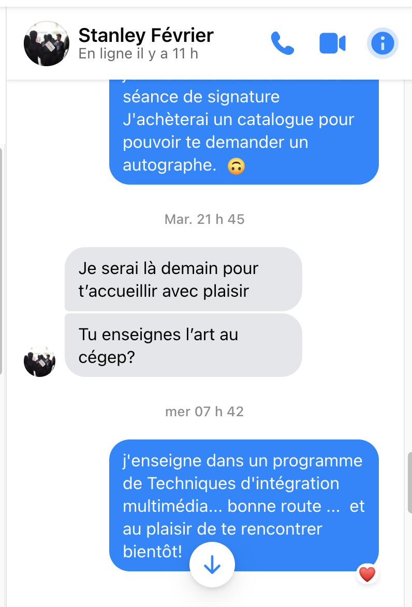

<link rel="stylesheet" href="../css/style.css">

# En route vers la réalité
  

[//]: # (## Le 18 novembre 2021, 19h30 Entrée #24)

[//]: # (> Jour de départ de Kaya qui retourne en Belgique avant de se rendre au Portugal où elle étudie le fado. )

[//]: # (> Je propose à Stanley Février d'être sa mère adoptive. Il accepte. )

[//]: # ([Comment extraire une conversation de messenger?]&#40;https://www.youtube.com/watch?v=TDKyj3oYeUM&#41;)

## Conversation avec ChatGPT sur le rôle d'un changement de nom ou d'apparence dans la démarche d'un(e) artiste
> [UMi] Un nom puissant donne du pouvoir et une grande vulnérabilité.
Norval Morriseau a pris le nom de "Copper Thunderbird" et cela lui a sauvé la vie.
Beaucoup d'artistes change de nom afin d'exprimer un changement dans leur identité.

> [ChatGPT-3]
Il est courant pour les artistes de choisir un nom de scène pour se démarquer et se créer une identité unique dans leur industrie. Le changement de nom peut être un moyen pour eux de se réinventer et de s'exprimer de manière différente. Cela peut également être un moyen pour eux de se protéger ou de se cacher derrière une identité différente, comme cela a été le cas pour Norval Morriseau qui a pris le nom de "Copper Thunderbird" pour se protéger de la violence de la rue. En fin de compte, le choix d'un nom de scène est une décision personnelle et peut être motivé par différentes raisons.

> [UMi] C'est faux. Le changement de nom de Morriseau n'a aucun lien avec la violence de rue.  
  
Voici un extrait de l'[article de Wikipedia sur Norval Morriseau](https://fr.wikipedia.org/wiki/Norval_Morrisseau) :
> À l'âge de 19 ans, il tombe gravement malade de la tuberculose. Il séjourne au sanatorium de Fort William 5. Il est emmené chez un médecin, mais sa santé continue de se dégrader. Il a alors une vision du manitou, qui lui assure sa protection. Craignant pour sa vie, sa mère appelle une femme médecin, qui effectue une cérémonie de changement de nom : elle lui donne le nouveau nom d'Oiseau-Tonnerre de Cuivre (Copper Thunderbird). Selon la tradition anishinaabe, donner un nom puissant à une personne mourante peut lui apporter une nouvelle énergie et sauver sa vie. Morrisseau se rétablit après la cérémonie et, dès lors, il signe toujours ses œuvres de son nouveau nom.  

> [UMi] Développe ce sujet en lien avec les arts visuels contemporains en mettant en relief le rôle d'un changement de nom ou d'un changement d'apparence dans la démarche d'un artiste. Exemples détaillés et données factuelles  
  
> [ChatGPT-3] Il y a de nombreux exemples d'artistes qui ont choisi de changer de nom ou d'apparence pour diverses raisons. Dans les arts visuels contemporains, cela peut être un moyen pour l'artiste de s'exprimer de manière plus authentique ou de créer une identité qui reflète leur travail et leur message artistique. Parfois, le changement de nom peut être un moyen pour l'artiste de s'éloigner de leur vie personnelle et de se concentrer sur leur travail artistique. Un exemple célèbre d'un artiste qui a choisi de changer de nom est Marina Abramovic, qui a changé son nom de "Marina Abramovic" à "Marina Abramovic-Ulay" lorsqu'elle a commencé à travailler en collaboration avec Ulay. Cela reflétait leur relation artistique et leur collaboration sur de nombreuses performances.  
  
  
<q><small>Beaucoup des oeuvres d'Ulay et de Marina Abramović font appel à la durée, comme dans <cite lang="en">Relation in time</cite>, où les artistes restent immobiles pendant 17 heures, les cheveux attachés l’un à l’autre  
Crédit photo : MARINA ABRAMOVIC INSTITUTE   
Source: <a href="https://ici.radio-canada.ca/nouvelle/1645627/ulay-et-marina-abramovic-performance-mort" target="blanck">Ulay et Marina Abramović : une histoire d’amour qui a changé le monde de l’art à jamais</a> </small></q>


> Un autre exemple est David Bowie, qui a choisi de se faire connaître sous le nom de scène "David Bowie" et a créé plusieurs personnages et alter egos au fil de sa carrière, comme Ziggy Stardust et The Thin White Duke. Cela lui a permis de s'exprimer de manière créative et de créer une identité artistique unique. En fin de compte, le choix d'un nom de scène ou le changement d'apparence peut être un moyen pour un artiste de se démarquer et de s'exprimer de manière unique dans les arts visuels contemporains. Cela peut être une décision personnelle qui reflète l'identité et la démarche de l'artiste.  

*Mercredi 11 janvier 11h11*
 
L'objectif est de libérer UMi.
 

# La Guilde de la Potière Jalouse
Ce projet a débuté à l'automne 2019, automne pendant lequel j'étais en congé avec salaire (traitement différé). Je me suis lancé à corps perdu dans la poterie ou plutôt dans la céramique.

Cet automne-là, j'ai aussi pris le cours "ART314 - Atelier du livre d'artiste"(****) à l'Université de Sherbrooke. En fait, je m'étais inscrite au "Microprogramme de 2e cycle en édition" mais je n'ai pris aucun cours dans ce programme, l'offre cet automne là ne me convenant pas. Le syllabus du cours ART314 m'a vraiment séduite et j'ai adoré ça. La prof (excellente Brigitte Roy) nous a fait expérimenter diverses techniques d'impression, de transfert d'image et de reliure. Elle nous a amené consulter une sélection de la collection de livres d'artistes du BANQ... C'était juste *wow*.

Voilà comment est né le *__Codex de la Guilde de la Potière Jalouse__*...  
Un petit livre d'artiste comportant 4 pages en céramique et des couvertures cartonnées recouvertes de cuir.

Il s'agit d'un hommage, d'une reconnaissance et d'un guide pour tous les courageux FAISEUX et FAISEUSES qui utilisent toutes leurs ressources émotives, affectives, sensuelles, intellectuelles, physiques, spirituelles, etc. pour créer des œuvres.

(Parfois l'IA est une nuisance à l'élaboration de la pensée. Je dois éviter de regarder l'écran et les suggestions pendant que je précise mes idées. C'est seulement quand j'ai besoin d'aide et que je suis perplexe que ça peut être utile.)

C'est l'heure du diner. À plus.

## La guilde existe
Chercher le mot clé <strong style="color:orange">#guildedelapotierejalouse</strong>... vous verrez...pas tout de suite peut-être, mais ça ne tardera pas.  
C'est une société secrète qui regroupe des dizaines de potières et potiers jaloux et jalouses et même des centaines, des milliers... des millions. Iels ignorent pour la plupart leur appartenance, certains intuitivement le savent depuis toujours. En tout cas dans mes rêves nous sommes innombrables dans les vestiges de la civilisation mourante. Chaque potier, chaque potiere jalouse sait dans le fond de son coeur qu'elle a un rôle à jouer dans le monde de demain.

Il y a deux manières d'adhérer à la Guilde:
1. en produisant une oeuvre signé de l'un des sceaux de la Guilde (se faisant c'est l'équivalent d'un diplôme de potière jalouse -cette expression inclus le masculin et le féminin-)
2. en signant la pièce selon votre propre sceau mais en publiant la pièce avec le hashtag #guildedelapotierejalouse

# UMi
*vendredi 23 septembre 2022*

UMi est le prénom de l'avatar.  
Un nom puissant donne du pouvoir.
Changer de nom, comme [Norval](https://www.invaluable.com/artist/morisseau-norval-d313z56a5l/sold-at-auction-prices/) devenu le _Copper Thunderbird_. <a href="#noteWikipedia">(*)</a>    
<del>
Un tournant dans la vie, un virage vers l'ailleurs.  
La cérémonie de ce changement sera liée subtilement et sans froufrou et flafla,
à l'émergence de la <strong style="color:orange">Guilde de la potière jalouse</strong>.</del>

~~Un nom puissant donne du pouvoir et une grande vulnérabilité.    
Demain, c'est le passé et le passé est demain.~~

_Parler de soi à la 3e personne._    
Parce qu'ici, il s'agit de transférer dans le monde physique mon avatar comme nouvelle identité.
Incarner mon humanité à la fois décuplée et réduite par les IA dont je suis déjà dépendante.
Après 5 vaccins contre la COVID-19, j'ai surement 3-4 puces d'implémentées non? Je blague bien sûr mais il n'y a qu'un pas à faire pour que notre intelligence collective se décuple avec les IA et à un moment donné, nous serons effectivement des genres de cyborg dont les mécanismes de réflexion sont alimentés par les savoirs collectifs. Ma nouvelle identité est en construction.

>Le corps est un véhicule de communication.
>La persona pèse plus ou moins 115 lbs, de taille moyenne, tout juste 1m63.  
>Reste à peaufiner le look: plus jeune, plus musclée, ce serait préférable.

Quand je pense qu'il y a depuis quelque temps pas mal de non renouvellement de contrats parmi les journalistes et présentatrices vieillissantes. Le cheveu gris n'est pas regardable ça l'air.

Références:
1. la fille aux cheveux bleus de Bilal   
   
2. mais en plusse badass comme Lisbeth Salander   
   ([Noomi Rapace](https://fr.wikipedia.org/wiki/Noomi_Rapace) dans le rôle).

# Ma rencontre avec Stanley Février

> [Activer la pensée critique    
S’attaquer aux causes profondes de l’exclusion systémique   
et au déséquilibre des pouvoirs dans les arts.](https://www.fevrierstanley.com/)

  

Dans la vingtaine, mon amie Barbara Michaud m'a fait connaître [Luce Irigaray](https://fr.wikipedia.org/wiki/Luce_Irigaray).  
J'ai flashé sur son essai *«[Le mystère oublié des généalogies féminines](mystere.md)»*. 
  
  
  
C'est cette lecture qui m'a amené à décider de remplacer mon patronyme par un matronyme.  
Mais où aller chercher son matronyme ? Il faut remonter aux origines, à l'autre en soi, à la mémoire cellulaire ou au cerveau reptilien, je ne sais pas.    
  
__Février, c'est le mois de ma naissance.__    
  
> demain, je termine au cégep vers 18h  
j'arriverai donc vers la fin de la séance de signatures  
  
  

  

  
(*) <q id="noteWikipedia"><small data-source="Wikipedia">Selon la tradition anishinaabe, donner un nom puissant à une personne mourante peut lui apporter une nouvelle énergie et sauver sa vie. 
</small></q>
