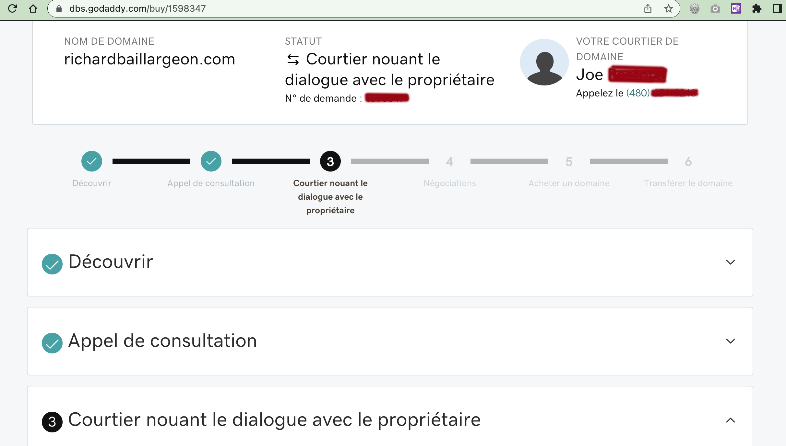

# The broker / Le courtier

Il s'appelle Luis Dinero. Il habite à Phoenix, Arizona, dans un petit 2 et demi avec son amoureux Sven Olafson, un joueur de football dans la ligue NFL. Il vit de ses commissions de 20% sur le rachat à gros prix de noms de domaines à des pirates et revendeurs.

  
## Étape 1 - trouver un courtier
> Hi Eve,  
Did you have a moment to review my recent email outlining the GoDaddy Domain Broker Service, along with my budget recommendation for negotiations?  
In order to get started, I'll require the "starting offer" and "max offer" range to negotiate for the purchase of RICHARDBAILLARGEON.COM.  
I'll do my best with any budget you provide and are comfortable with - here is my personal recommendation for this domain name:  
$500.00 USD  -  $1500.00 USD  
Can you please reply to this email either approving the recommended budget range above or providing your own budget range the we can use?  
Regards,  
Luis Dinero

## Mea Culpa
J'ai dormi sur la switch.
En me fiant complètement au renouvellement automatique programmé sur GoDaddy.
En oubliant que mon mode de paiement était échu suite à l'annulation de ma carte de crédit après une pseudo-fraude transactionnelle. _Mea Culpa_. J'ai été négligente. _Mea culpa_. _Mea maxima culpa._

### Parenthèse du désespoir
<del> Juste une catastrophe de plus dans la vie d'une fille qui n'a plus de vie.   
C'est comme ça quand on se peinture dans le coin.   
Même si on le fait avec de <strong style="color:orange">belles</strong> <strong style="color:darkviolet">couleurs</strong>, se fondre dans le décor du théâtre capitaliste n'est pas joyeux.   
Depuis le début de cette session, la descente (plongeon?) est amorçée.  
Quand je me suis retrouvé en surtâche parce que le gars aux cheveux lissés par en arrière est en <i lang="en">burnout</i> et qu'on a pas réussi à engager un autre prof.   
Dès le début de cette session... ma belle chatte</del>  

[Minouche, alias Kali Prakash la blanche](https://www.instagram.com/kali_la_blanche/)  
  
<del>a disparue et je me dis que c'est ce que je devrais faire aussi.  
Maudit tabarnak. </del>

## Étape 2 - la négociation

## Processus expliqué
Dans un premier échange de courriel, j'insiste pour qu'on m'explique le processus.
> Hello,  
Absolutely! We would like to help you acquire this domain name.  
This domain is currently owned, and you purchased the Domain Broker Service for this domain name where we contact the owner on your behalf and negotiate with the owner and have them sell it to you then you can use the domain.  
The way the process works is as follows: 
> (1) We set a budget for how much you’re willing to spend on the domain. 
> (2) We then engage with the owner and negotiate the best price for you within your budget.
> (3) If we come to an agreement with the owner within your budget, we will expect payment + 20% broker service fee within 72 hours of both the buyer (you) and the owner agreeing. 
> (4) Once the payment is made the domain will be transferred to your GoDaddy account.
If we are unable to come to an agreement, you’re not obligated to pay anything.  
This is a private service and can not give out information of buyer or seller.
I will keep to try and contact the owner and update you as soon as I hear back.  

   