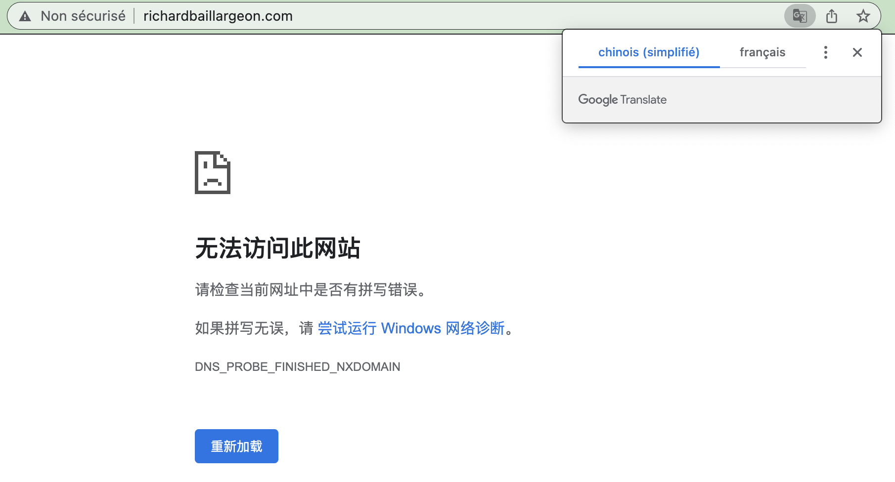

# The broker / Le courtier

Il s'appelle Luis Chavèz. Il vit à Phoenix Arizona dans un petit 2 et demi avec son amoureux Sven Olafson, un joueur de football dans la ligue professionnelle. 
NFL sûrement. 

> Hi Eve,  
Did you have a moment to review my recent email outlining the GoDaddy Domain Broker Service, along with my budget recommendation for negotiations?  
In order to get started, I'll require the "starting offer" and "max offer" range to negotiate for the purchase of RICHARDBAILLARGEON.COM.  
I'll do my best with any budget you provide and are comfortable with - here is my personal recommendation for this domain name:  
$500.00 USD  -  $1500.00 USD  
Can you please reply to this email either approving the recommended budget range above or providing your own budget range the we can use?  
Regards,  
Luis Chavez  

Mon courriel suppliant a dû l'agacer prodigieusement.  
Pas de la bonne _business_ ça.  
Juste une bonne femme qui ne s'est pas occupé de mettre à jour ses coordonnées de carte bancaire liée au renouvellement automatique du nom de domaine de l'artiste richardbaillargeon. Juste une catastrophe de plus dans la vie d'une fille qui n'a plus de vie.   
C'est comme ça quand on se peinture dans le coin.   
Même si on le fait avec de belles couleurs, se fondre dans le décor du théâtre capitaliste n'est pas joyeux.   
Depuis le début de cette session, la descente (plongeon?) est amorçée.  
Quand je me suis retrouvé en surtâche parce que le gars aux cheveux lissés par en arrière est en _burnout_ et qu'on a pas réussi à engager un autre prof.   
Dès le début de cette session... ma belle chatte [Minouche, alias Kali Prakash la blanche](https://www.instagram.com/kali_la_blanche/) a disparue et je me dis que c'est ce que je devrais faire aussi. Mais pas avant d'avoir récupéré le nom de domaine de Richard.   
  
Maudit tabarnak. 
  
  
   