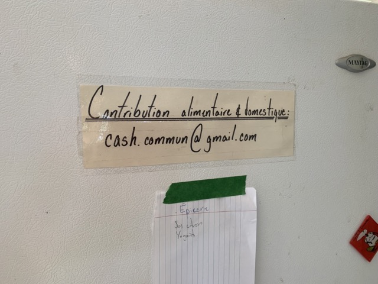
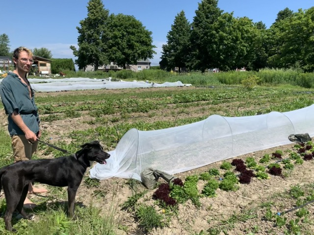
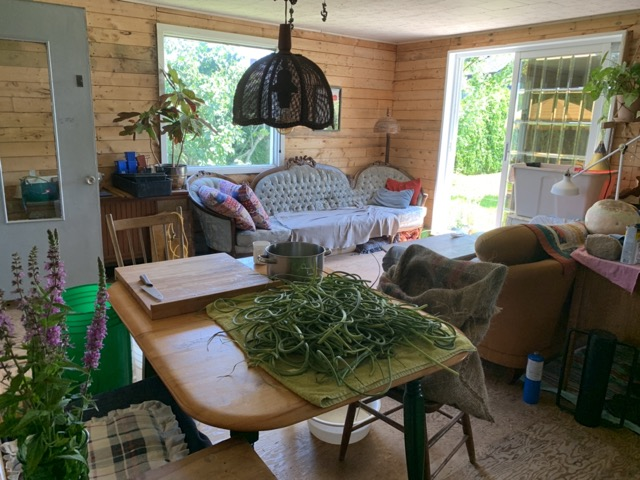

# Premier *roadtrip* avec la petite 🥷 [ninja 650](https://www.kawasaki.ca/en-ca/motorcycle/ninja/sport/ninja-650/2021-ninja-650-abs)

Près de 700 kilomètres entre Québec, Saint-Antoine-de-Tilly, St-Pierre-les-Becquets, Trois-Rivières, Lachute, Val-David et retour en serpentins à travers les Laurentides jusqu'à St-Élie de Caxton, la 155 entre St-Boniface et Trois-Rivières et la 138 de Batiscan à Québec.

## À l'aller
Départ 7h50, arrivée à St-Antoine de Tilly à 8h35.
Petit café avec Hugh et Ralph.
Albert le magnifique chat tabby et blanc n'y est pas, il est déjà parti trotter son territoire.
Pour rassurer ma maman de 84 ans qui a une peur bleue des motos, je ne mentionne que ma prochaine destination: une visite à Tristan qui passe la semaine aux Becquets, avec la gang de la ferme. La veille, elle a tenté de me dissuader d'aller jusqu'à Val-David car elle trouvait ça trop loin... et moi de rétorquer qu'elle était paternaliste, que si j'étais un garçon elle réagirait autrement... mais ma rhétorique était à côté de la plaque. Bref, je ne voulais pas la narguer, ses inquiétudes m'avaient bien ébranlée un peu mais j'avais trop envie de cette aventure sur ma petite Ninja 650 de novice (je prévois passer l'examen sur route au début de l'automne).

Départ de St-Antoine vers 10, arrivée à St-Pierre-les-becquets vers 11h.
Première image prise à 11h16. 

Aux Becquets, c'est la gang qui a mis en place l'épicerie 13/2 dans Limoilou. Ils sont de cette jeunesse ardente et idéaliste qui s'invente un mode de vie anticapitaliste en s'appuyant sur la mise en commun plutôt sur les illusoires satisfactions du consumérisme individualiste et la cellule familiale patriarcale. Enfin, c'est ma façon de voir leur fonctionnement. Tristan me fait visiter la ferme. Dindons et poules. Très grand potager. Cuisine extérieure de transformation. Grande serre pour certains légumes. Petite serre pour les semis. Dans la maison de Julien, Val, Pierre-Élie et Tau, il y a une récolte de fleurs d'ail qui attends d'être préparée pour la fermentation.

Lorsque je quitte les Becquets, il est midi 45.
Mon fils ne m'ayant pas offert plus qu'une exquise limonade, je m'arrête dans un A&W peu après avoir traversé sur l'autre rive par le pont de Trois-Rivières. C'est un pont tout en métal, ce qui m'a un peu effrayée au départ car je craignais que ce soit glissant. Ça ne l'était pas. 

[Trajet entre Québec et Yamachiche](https://goo.gl/maps/FqU2A8ZJBvZRjGF48)

[Trajet entre Yamachiche et Lachute](https://goo.gl/maps/NPWutPZrx2rg5QWF7)

[Trajet entre Lachute et Val-David](https://goo.gl/maps/FWPT83S3NuC9amEM8)

## Au retour

[Trajet entre Val-David et Québec](https://goo.gl/maps/1eBh1e144kQNXvff7)

p.s.: C'est seulement après ce premier *roadtrip* que j'ai appris comment vérifier le niveau d'huile. Fallait être 2 pour que pendant que l'un est sur la moto l'autre peut évaluer correctement le niveau qui doit être entre les 2 lignes mais plus proche de la ligne supérieure.