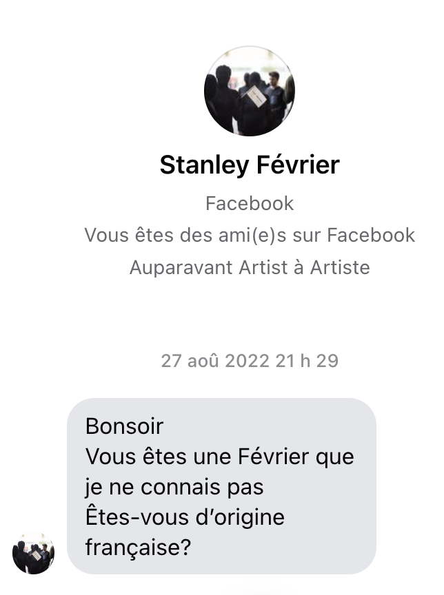
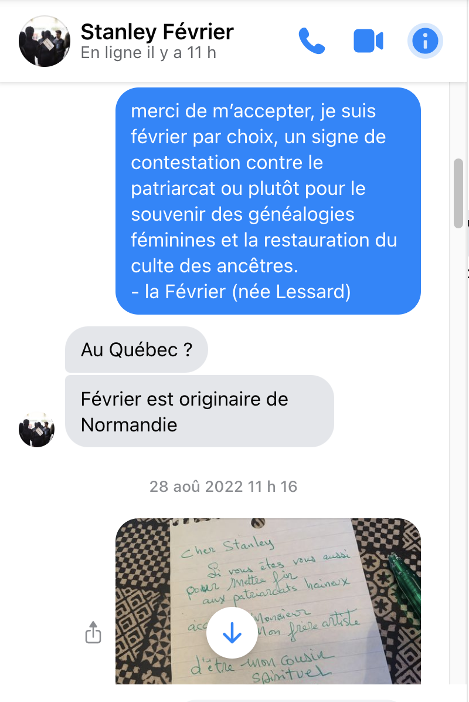
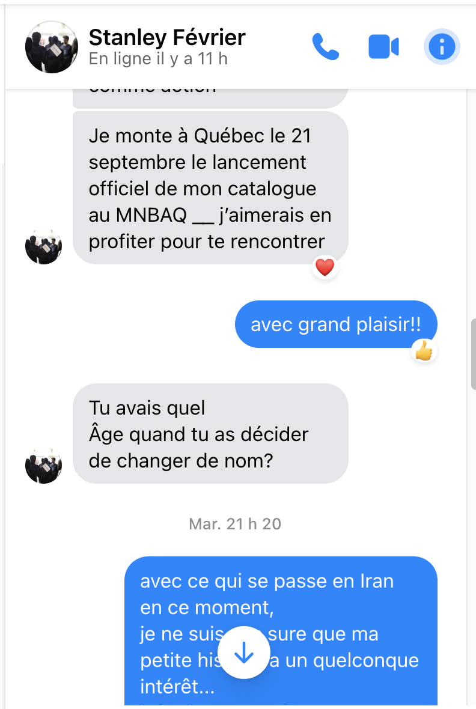
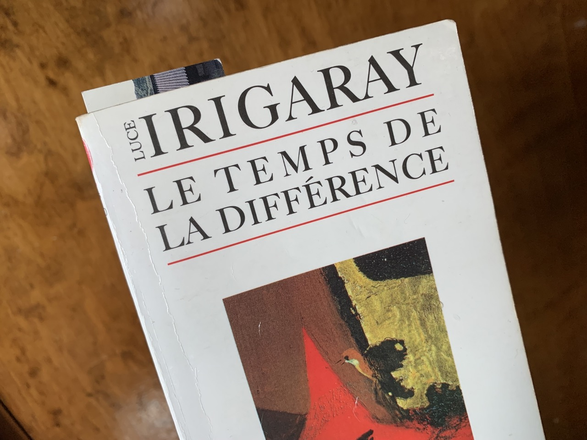
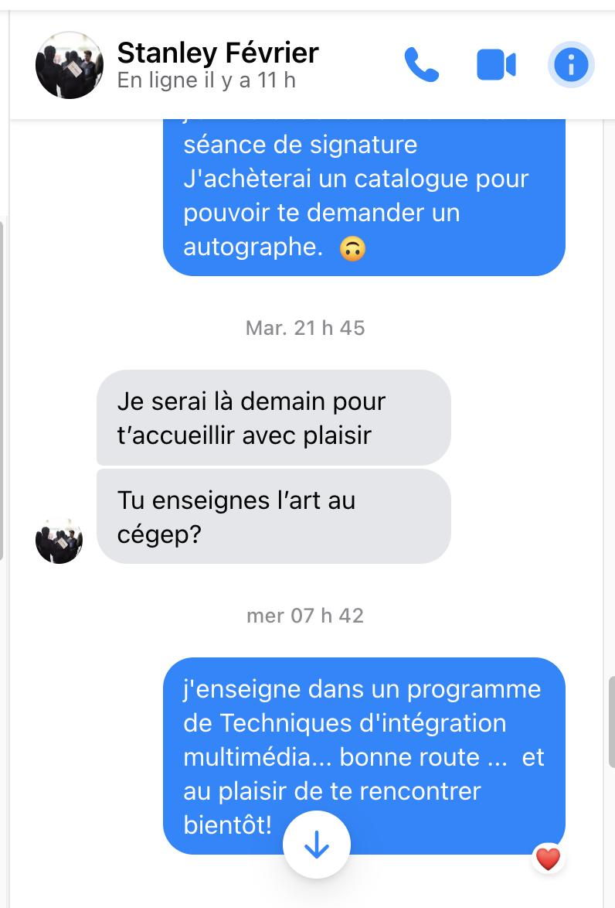

<link rel="stylesheet" href="css/style.css">

*vendredi 23 septembre 2022*  

# UMi
sera mon prochain prénom.  
  
Mon baptême sera celui de la Guilde de la potière jalouse.  
Changement de vie.  
Réincarnation.  
  
Comme Norval devenu le _Copper Thunderbird_.  
Un nom puissant donne du pouvoir.  
et une grande vulnérabilité  
le passé est demain  
demain c'est le passé  
  
elle pèse 112 livres  
j'aimerais qu'elle ressemble à la fille aux cheveux bleus de Bilal  
mais en plusse badass comme Lisbeth Salander  
  
parler de soi à la 3e personne  
quand le corps n'est plus qu'un véhicule de communication  

## Ma rencontre avec Stanley
  
> Activer la pensée critique 
S’attaquer aux causes profondes de l’exclusion systémique 
et au déséquilibre des pouvoirs dans les arts.

  

Dans la vingtaine, mon amie Barbara Michaud m'a fait connaître Luce Irigaray..  
J'ai flashé sur son essai *«Le mystère oublié des généalogies féminines»*.  

C'est cette lecture qui m'a amené à décider de remplacer mon patronyme par un matronyme.  
Mais où aller chercher son matronyme ? Il faut remonter aux origines, à l'autre en soi, la mémoire cellulaire ou le cerveau reptilien, je ne sais pas.    
  
__Février, c'est le mois de ma naissance.__    
  
demain, je termine au cégep vers 18h  
j'arriverai donc vers la fin de la séance de signature  
et si je fais pas d'accident de moto (énervée comme une puce?)  
J'achèterai un catalogue pour pouvoir te demander une dédicace!  

