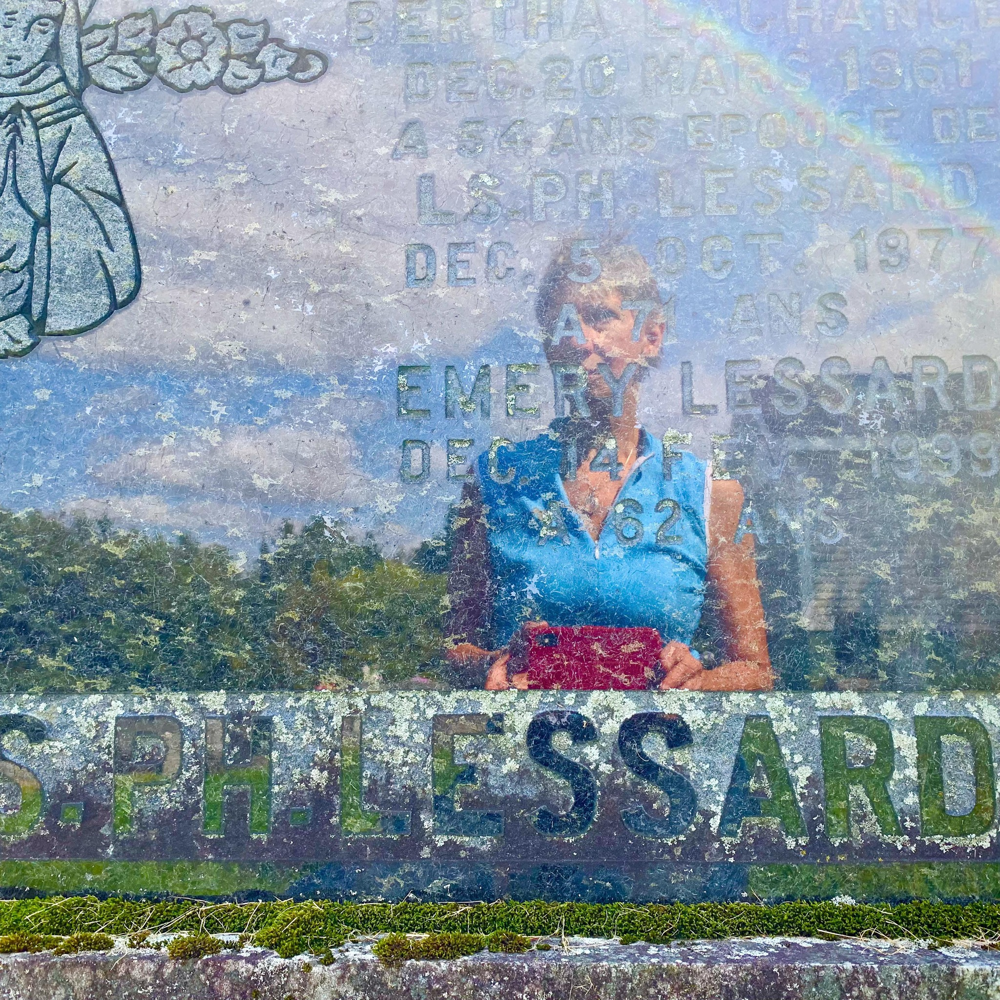

# Le culte des ancêtres
__Une courte expédition shivaïque__

Fumer un joint dans le cimetière de Sainte-Justine.
Admirer le vieux pin qui fournit un bel ombrage.
Ramasser une de ses cocottes.
Capter ma réflexion sur la pierre tombale.

Prendre conscience qu'Émery est le seul de la quinzaine d'enfants qu'a eu Bertha à occuper le caveau familial au nom du patriarche Louis-Philippe.

Je n'ai pas connu ma grand-mère car elle est morte très jeune, à 54 ans d'un cancer. Sur la seule photo que je possède d'elle, c'est une jolie brunette à la mine enjouée, encore adolescente, parmi une très nombreuse fratrie. 

Quinze grossesse en 19 ans...