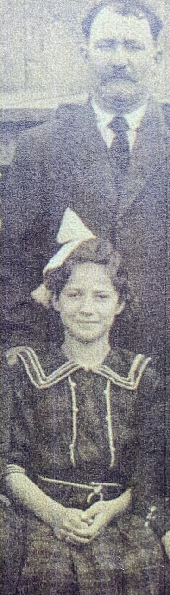

<link rel="stylesheet" href="css/style.css">

# Le culte des ancêtres
__Une courte expédition shivaïque__

Fumer un joint dans le cimetière de Sainte-Justine.
Admirer le vieux pin qui fournit un bel ombrage.
Ramasser une de ses cocottes.
Capter ma réflexion sur la pierre tombale.

Prendre conscience qu'Émery est le seul de la quinzaine d'enfants qu'a eu Bertha à occuper le caveau familial au nom du patriarche Louis-Philippe.

Je n'ai pas connu ma grand-mère car elle est morte avant ma naissance, 3 mois avant d'atteindre 55 ans, d'un cancer. Sur la seule photo que je possède d'elle, c'est une jolie brunette à la mine enjouée, encore adolescente, parmi une très nombreuse fratrie. 
  
  
_extraite de la photo de famille complète, 1919 ou 1920 approximativement.  
Maudit que le monde était pauvre dans ce temps là.  
Souper avec des patates pis du beurre c'était ben correct._  

## Alberta

### Quinze grossesse en 19 ans...  
Je pense qu'on peut nommer cela un esclavage du ventre.
    
### Son véritable prénom était _Alberta_.
Elle est née en 1906 et décédée en 1961.
> L'Alberta, qui est devenu officiellement une province en 1905, doit son nom au Marquis de Lorne, gouverneur général du Canada entre 1878 et 1883. En effet, celui-ci a proposé le nom d'Alberta en l'honneur de sa femme, la princesse Louise Caroline Alberta, qui était la fille de la reine Victoria

_Maintenant je comprends qu'Albert peut devenir Alberta et Alberta, **Libarté**_