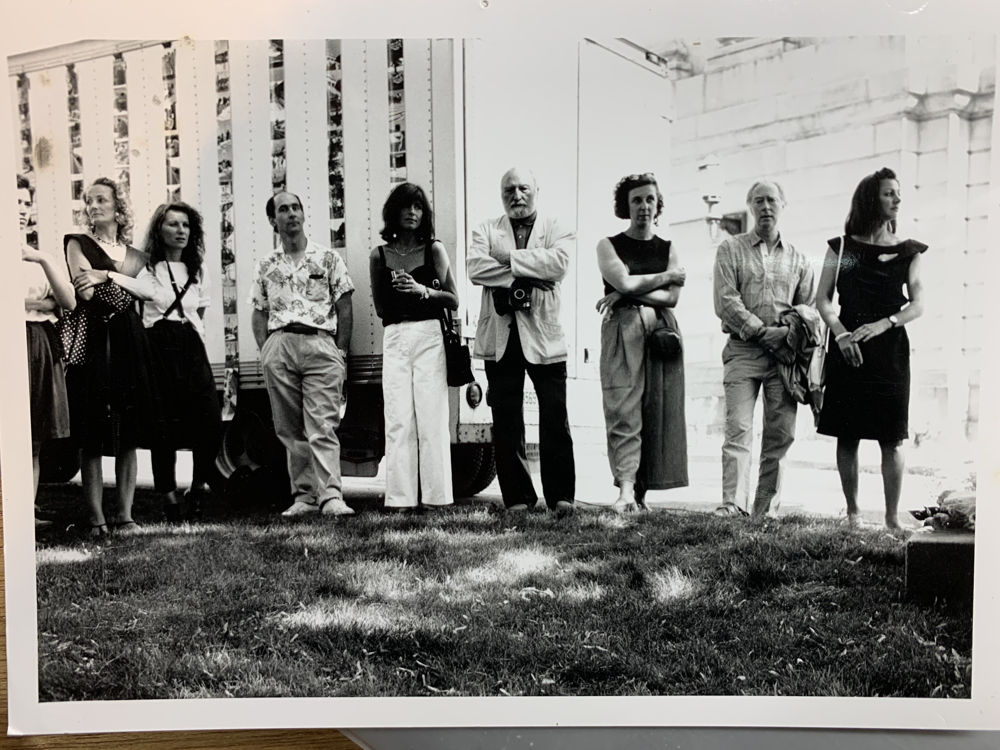
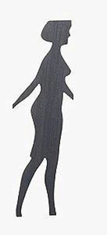
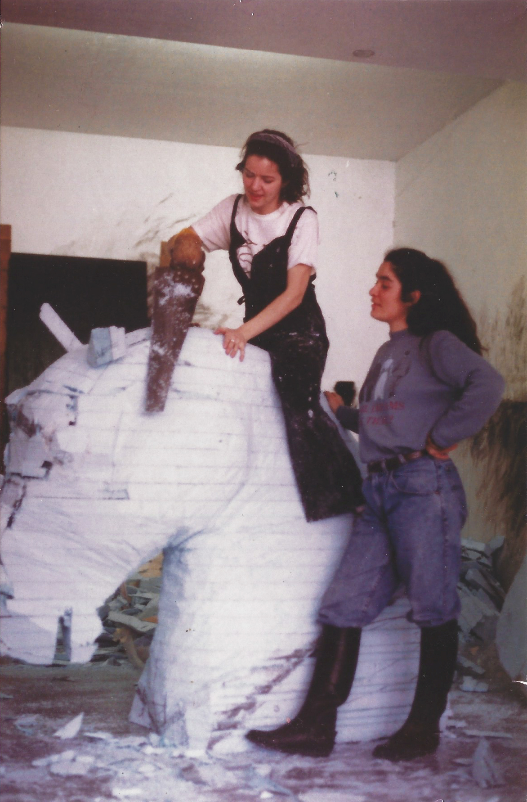
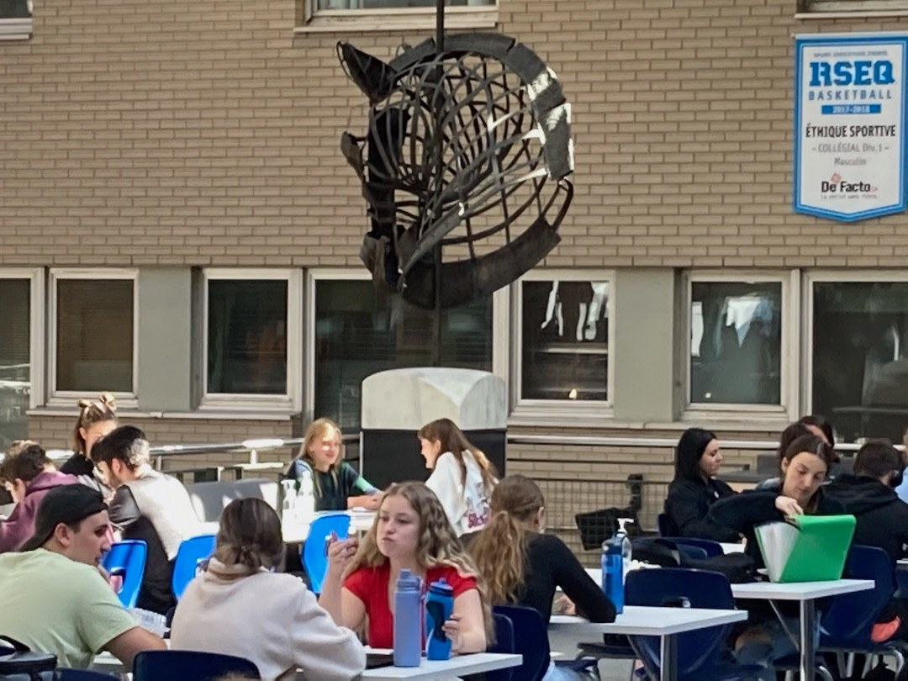

# Artiste contemporaine, performeuse

## Démarche 
- Ce qu'elle fait (son travail)
Multidisciplinarité de l'artiste  
Dessin, peinture, sculpture, performance sonore, installation, expérience immersive.
- Ce qu'elle écrit sur son travail

## Jalons
### Entre le dire et le sentir II : l'escalier    
*30 mars au 31 mai 1992*  
- Texte de Guy Sioui Durand dans la revue Inter #.   
_Débouler, flotter... heureusement_   
- Photographies de Ivan Binet

### La *Walking Woman* de l'Île d'Orléans  
*Été 1991*  
     
Lors de l'événement *__Paysage verticaux__*, Cécile est l'assistante de Michaël Snow.      
Elle connecte et s'identifie complètement à la "Walking Woman" de Snow.  
Elle personnalise un t-shirt avec l'inscription "Je suis née en 1961, mon père en 1929. Je suis WALKING WOMAN "  
    
Très active dans les réseaux professionnels, Cécile est:
- membre de Videre de 1989 à 1991, 
- membre du CA de la Galerie des Arts Visuels de l'Université Laval en 1990-1991.
- récipiendaire de la bourse René Richard en 1991  

### Métamorphoses
Réalisation de l'oeuvre «Métamorphoses», une sculpture en bronze et en marbre représentant une tête de cheval, sous la direction de Lucienne Cornet.  

  
Cécile Létourneau et Safia Leghari.    

  
L'oeuvre Métamorphoses dans la cafétéria du Cégep de Sainte-Foy  
  
## Couverture de presse

