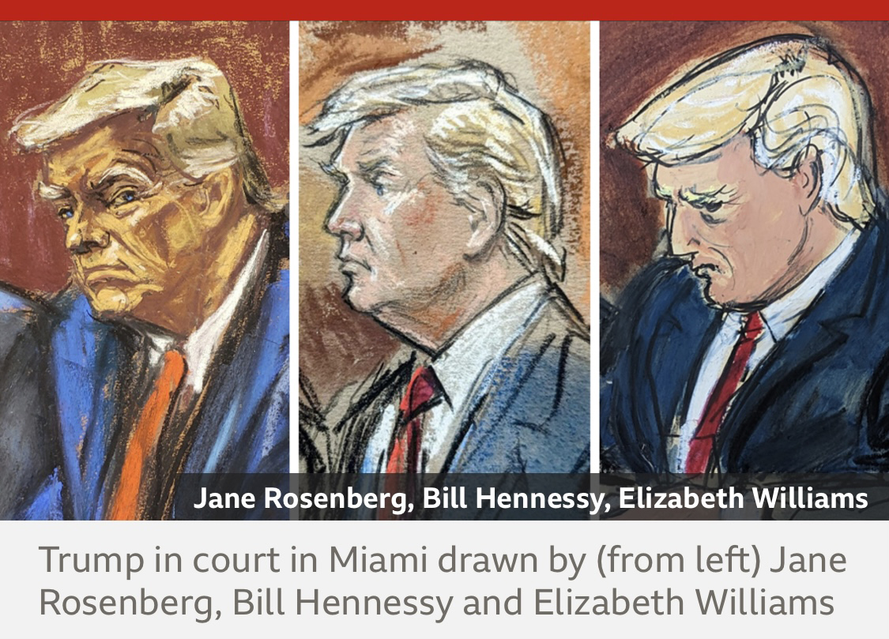
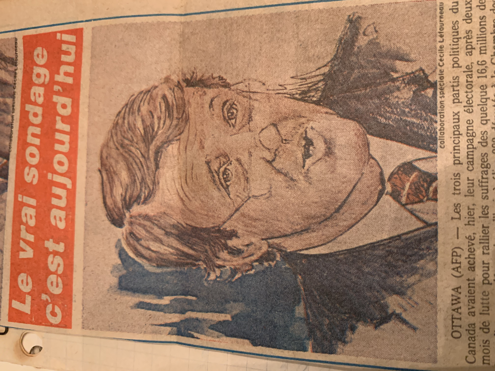
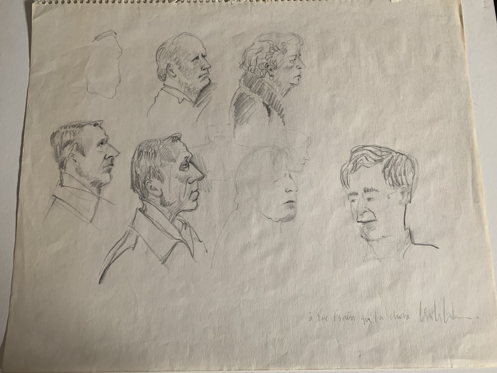

# Portraitiste, dessinatrice d'audience
> Cameras and other recording devices have been prohibited for decades in the vast majority of US federal courtrooms, leaving a record of proceedings in the hands of sketch artists. Their work is done under intense pressure. The images are usually filed at the hearing's next adjournment which means they can appear on front pages and cable news channels within minutes.

Sam Cabral

> « Faced with very tight deadlines, stressful courtroom restrictions and
no tolerance for creative freedom, the artists all do the best they can. »

Jane Rosenberg

Extraits de [Court artists on their three, very different Trumps](https://www.bbc.co.uk/news/world-us-canada-65905926) 

   

## no tolerance for creative freedom
  
   
